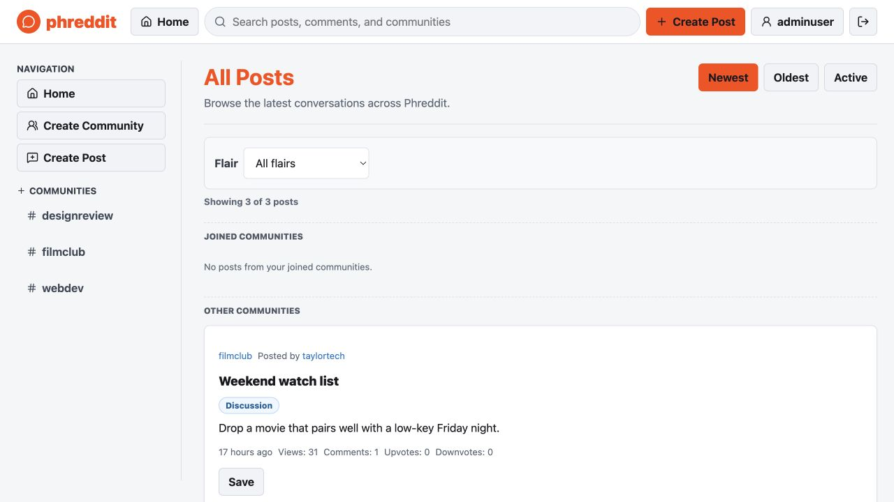
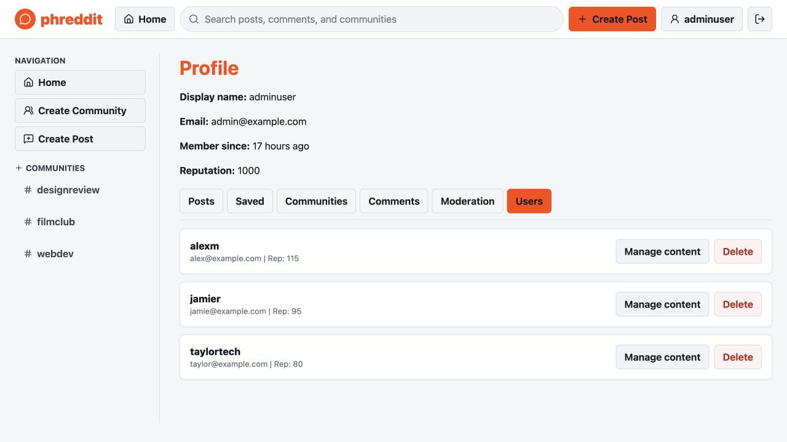

# Phreddit

[](https://github.com/rishrm/phreddit/actions/workflows/ci.yml)
[](LICENSE)

Phreddit is a full-stack Reddit-inspired community forum built with React, Express, MongoDB, and Mongoose. It supports guest browsing, session-based accounts, communities, posts, link flair, arbitrary-depth threaded comments, saved posts, toggleable reputation-aware voting, live post updates over WebSockets, Markdown rendering, cross-entity discovery, public user profiles, reporting, and auditable admin moderation flows.

The project is structured as a portfolio-ready MERN application with lazy client-side routes, server-side pagination and sorting, isolated backend integration tests, client unit tests, Playwright e2e coverage, and a CI pipeline.

**Live demo:** [phreddit.vercel.app](https://phreddit.vercel.app)
Visitors can browse as a guest or register a new account.

## Screenshots





## Features

- Guest browsing plus registration, login, logout, and persisted sessions
- Client-side routing with real URLs and deep links (`/posts/:id`, `/communities/:id`, `/users/:id`, `/search?q=...`)
- Live post pages: comments, votes, and edits from other users appear in real time over Socket.IO
- Server-side pagination and sorting (Newest, Oldest, Active) with indexed, materialized comment activity and a Load More UI
- Unified discovery across posts, comments, communities, public users, and link flairs using weighted MongoDB text indexes
- Toggleable voting: vote, unvote, or switch votes with atomic database updates; no self-voting; reputation deltas reverse correctly
- Arbitrary-depth threaded comments assembled from one indexed query (with a 5,000-comment response guard), plus Newest/Top sorting
- Markdown post and comment bodies, sanitized with DOMPurify before rendering
- Public user profiles showing display name, reputation, and recent activity (no private data)
- Saved posts/bookmarks with a dedicated profile tab
- Post reporting with duplicate-report protection, an admin queue, optional resolution notes, and filterable resolution history that preserves evidence after deletion
- Admin user list, viewing another user's profile, and cascade user deletion behind an accessible confirm dialog
- Cascade deletion for communities, posts, comments, replies, and user-owned content
- Session hardening: session ID regeneration, constant-work invalid-login verification, on-demand guest CSRF sessions, trusted-origin checks, Helmet headers, CORS allowlist, and bounded global/auth rate limiting
- Private no-store API delivery, validated request correlation IDs, and a database-aware health check for deployment diagnostics
- Responsive layout, keyboard-visible focus states, lazy route loading, a render recovery boundary, loading/empty/error states, and distinct success/error toasts
- Unit (server + client), integration, and Playwright e2e tests in GitHub Actions, plus repository-level CodeQL analysis

## Tech Stack

- **Client:** React 18, Vite, react-router-dom, socket.io-client, Lucide, marked + DOMPurify, Vitest + React Testing Library, Playwright
- **Server:** Node.js, Express 4, Socket.IO, Mongoose 8, express-session + connect-mongo, express-rate-limit, bcrypt, helmet
- **Database:** MongoDB (text indexes for search, compound indexes for listings)

## Project Structure

```
phreddit/
├── client/               # React app (Vite)
│   ├── src/
│   │   ├── api/          # fetch wrapper for the REST API
│   │   ├── components/   # Banner, PostCard, CommentItem, ConfirmDialog, RichText, ...
│   │   ├── pages/        # routed pages (Home, Post, Community, Profile, UserProfile, ...)
│   │   ├── realtime.js   # Socket.IO subscription helper
│   │   └── utils/        # formatting + post/comment helpers (unit tested)
│   └── e2e/              # Playwright specs
├── server/
│   ├── bench/            # dependency-free benchmark + volume seeder
│   ├── middleware/        # auth, CSRF/origin checks, rate limiting
│   ├── models/           # Mongoose schemas + indexes
│   ├── routes/           # REST endpoints
│   ├── tests/            # node:test unit + integration suites
│   ├── utils/            # voting, serialization, validation, cascade deletes
│   ├── realtime.js       # Socket.IO emit wrapper
│   └── server.js         # app factory + HTTP/Socket.IO bootstrap
├── .github/workflows/ci.yml
├── AGENTS.md             # commands + invariants for AI coding agents
├── render.yaml           # Render blueprint for the API
└── vercel.json           # Vercel config for the client
```

## Setup

Requirements: Node.js 20+ and a local MongoDB (or Atlas connection string).

```bash
# 1) Install dependencies
npm run install:all

# 2) Configure the server
cp server/.env.example server/.env   # edit values as needed

# 3) (Optional) seed demo data into the named database (destructive)
ADMIN_PASSWORD='AdminPass123!' DEMO_PASSWORD='DemoPass123!' \
CONFIRM_DATABASE_RESET=phreddit node server/init.js admin@example.com adminuser

# Assignment-compatible shorthand for the default local phreddit database
node server/init.js admin@example.com adminuser 'AdminPass123!'

# 4) Run the API (http://localhost:8000)
npm --prefix server run dev

# 5) Run the client (http://localhost:5173) in another terminal
npm --prefix client run dev
```

The Vite dev server proxies both `/api` and the `/socket.io` WebSocket to the API, so no client env vars are needed locally.

## Demo Accounts

The optional seed command creates one administrator plus three sample users. Remote/custom-database seeds require environment secrets and explicit reset confirmation; the three-argument shorthand is accepted only for the default local `phreddit` database. Passwords are never printed.

| Role | Email | Password |
|---|---|---|
| Admin | Value passed to `init.js` | `ADMIN_PASSWORD` |
| User | `alex@example.com` | `DEMO_PASSWORD` |
| User | `jamie@example.com` | `DEMO_PASSWORD` |
| User | `taylor@example.com` | `DEMO_PASSWORD` |

`server/init.js` erases the selected database. It requires `CONFIRM_DATABASE_RESET` to exactly match the database name except in the assignment-compatible default-local mode shown above.

## Environment Variables

Server (`server/.env`):

| Variable | Purpose | Default |
|---|---|---|
| `MONGO_URI` | MongoDB connection string | `mongodb://127.0.0.1:27017/phreddit` |
| `PORT` | API port | `8000` |
| `SESSION_SECRET` | Session signing secret (set a long random value) | dev fallback |
| `CLIENT_ORIGIN` | Comma-separated allowed CORS origins | localhost:5173 |
| `ADMIN_EMAIL` | Existing administrator to verify at startup (never auto-promotes) | unset |
| `ADMIN_PASSWORD`, `DEMO_PASSWORD` | Required only by the destructive demo-data seed; never logged | unset |
| `CONFIRM_DATABASE_RESET` | Database name required to authorize the destructive seed | unset |
| `SESSION_COOKIE_SAMESITE` | Cookie same-site policy; Vercel proxy deployments use `lax` | `lax` |
| `SESSION_COOKIE_SECURE` | `true` in production (HTTPS) | `false` |
| `SESSION_TTL_MS` | Browser/session-store lifetime in milliseconds | 7 days |
| `TRUST_PROXY` | `true` behind a reverse proxy (Render, etc.) | `false` |
| `JSON_BODY_LIMIT` | Request body size cap | `1mb` |
| `AUTH_RATE_LIMIT_*`, `API_RATE_LIMIT_*`, `DISABLE_RATE_LIMIT` | Login/register and global API rate limiting | see `.env.example` |

Client (`client/.env`):

| Variable | Purpose |
|---|---|
| `VITE_SOCKET_URL` | Render API origin used by Socket.IO in production |
| `VITE_API_BASE_URL` | Direct API base for local/non-Vercel deployments; leave unset on Vercel |
| `VITE_DIRECT_API` | Set `true` only to bypass the production same-origin `/api` proxy |

`NODE_ENV=test` (set automatically by the test scripts) enables a test-only `x-test-user-id` auth header used by the integration suite. It is inert in any other environment.

## Scripts

Root convenience scripts:

| Script | What it does |
|---|---|
| `npm run install:all` | `npm ci` in both `server/` and `client/` |
| `npm run lint` | ESLint for server and client |
| `npm run test:unit` | Server unit tests (node:test) + client unit tests (Vitest) |
| `npm run test:int` | Server integration tests (needs MongoDB; uses a disposable database) |
| `npm run test:e2e` | Playwright end-to-end tests (boots API + client; needs MongoDB) |
| `npm run build` | Production client build |

Server extras: `npm --prefix server run admin:promote` (explicit administrator promotion), `npm --prefix server run bench:seed` (seed a benchmark database), and `npm --prefix server run bench` (dependency-free HTTP load test).

## Testing

| Suite | Command | Needs MongoDB | CI job |
|---|---|---|---|
| Server unit (31 node:test tests) | `npm --prefix server run test:unit` | No | lint-and-unit |
| Client unit (33 Vitest + RTL tests) | `npm --prefix client run test:unit` | No | lint-and-unit |
| Server integration (31 supertest tests, disposable DB per data suite) | `npm run test:int` | Yes | integration |
| End-to-end (4 Playwright browser flows) | `npm run test:e2e` | Yes | e2e |

The current matrix contains 99 automated tests: 31 server unit, 31 server integration, 33 client unit, and 4 Playwright flows. Integration tests spin up Express in-process against throwaway databases and run in CI against a MongoDB replica set with transactions forced. Regression coverage includes session-bound CSRF enforcement, guest session avoidance, DB-aware health, cross-entity discovery privacy, materialized Active-sort metadata and legacy backfills, membership-aware pagination, private vote serialization, authoritative cascade deletion, moderation history/claim races, and vote/reputation lifecycles. Playwright runs with CSRF enforcement enabled and covers desktop creation/profile/voting/discovery, a two-browser realtime check, and mobile keyboard/overflow behavior.

Contributing with an AI coding agent? Repo commands and invariants live in [AGENTS.md](AGENTS.md).

## Benchmarks

To produce a defensible throughput/latency number for the listing endpoint:

```bash
# Terminal 1 — seed and serve a volume dataset
MONGO_URI=mongodb://127.0.0.1:27017/phreddit_bench \
CONFIRM_DATABASE_RESET=phreddit_bench npm --prefix server run bench:seed -- 2000
MONGO_URI=mongodb://127.0.0.1:27017/phreddit_bench \
DISABLE_RATE_LIMIT=true npm --prefix server start

# Terminal 2 — run the load test (50 connections, 15s by default)
npm --prefix server run bench
```

The recorded 2,000-post/6,000-comment local profile observed 947-1,000 successful req/s with 69.1-98.9 ms p99 for Active sort after replacing correlated per-post comment lookups with transactionally maintained activity metadata. The measured baseline was 40 req/s at 1,788.7 ms p99. See [docs/PERFORMANCE.md](docs/PERFORMANCE.md) for the full commands, environment, repeated results, query plan, and limitations. These are local endpoint measurements, not a claim about simultaneous production users.

## Deployment

The client and API deploy separately.

**Database — MongoDB Atlas (free M0):**
1. Create a cluster and a least-privilege database user. Restrict network access to Render egress ranges when your plan provides stable ranges; otherwise use Atlas's temporary broad allowlist with a strong generated database password.
2. Copy the connection string; this is `MONGO_URI`.

**API — Render (free):**
1. Push this repo to GitHub, then in Render choose **New → Blueprint** and select the repo (`render.yaml` configures the service).
2. Set `MONGO_URI` to the Atlas string and `CLIENT_ORIGIN` to your exact Vercel production URL. The blueprint sets HTTPS cookies, proxy trust, session lifetime, and the API rate limit. Unsafe production requests require both a session-bound CSRF token and a matching `Origin`.
3. Verify `https://<api>.onrender.com/api/health` returns `{ "ok": true }`. Register the production owner through the app, then promote it explicitly with `MONGO_URI=<atlas-uri> ADMIN_EMAIL=<email> CONFIRM_ADMIN_PROMOTION=<email> npm --prefix server run admin:promote`. Set the same `ADMIN_EMAIL` in Render and redeploy; startup verifies it but never changes privileges.
4. To replace an empty database with sample data, run the guarded seed command from Setup with `MONGO_URI` pointed at Atlas and `CONFIRM_DATABASE_RESET` set to the Atlas database name. It intentionally erases that database first.

**Client — Vercel (free):**
1. Import the repo into Vercel. `vercel.json` builds the client, preserves SPA deep links, and proxies `/api/*` to the Render API so browser sessions remain first-party and work in Safari.
2. Set `VITE_SOCKET_URL=https://<api>.onrender.com`. Socket.IO connects directly because Vercel external rewrites do not proxy WebSocket upgrades. If the Render service name changes, update both this variable and the external `/api` destination in `vercel.json`.
3. Leave `VITE_API_BASE_URL` unset (or remove an older value) and deploy. Verify `/api/health`, registration, login, logout, and a live two-window comment from the public Vercel URL.

## Architecture Notes

- **App factory:** `createApp()` builds the Express app without binding a port, so integration tests run against an in-process app with a disposable database per test file. `startServer()` wraps it in an HTTP server and attaches Socket.IO.
- **Realtime:** route handlers publish through a small `realtime.js` wrapper (`emitPostUpdated`). Clients on a post page join a `post:<id>` room and refetch on updates — an invalidation-style design that stays correct without duplicating server state on the client.
- **Voting:** vote add/remove/switch are single conditional `findOneAndUpdate` operations, so concurrent requests cannot double-count. `votedBy` is never sent to clients; each response carries only the caller's own `userVote`.
- **Comments:** fetched flat with one indexed query (`{ post: 1, createdAt: -1 }`) and assembled iteratively in memory, so nesting depth is not truncated by recursive populate. A 5,000-comment response cap prevents unbounded memory use and is surfaced to the UI.
- **Discovery:** post/comment search resolves matching ids first because `$text` cannot appear inside `$or`; a separate bounded endpoint uses weighted text indexes to return safe community, public-user, and flair matches without exposing member lists or email addresses.
- **Listings:** pagination and all three sorts are computed database-side. `commentCount` and `latestCommentAt` are maintained with comment writes, recomputed after comment-tree deletion, and backfilled in bounded startup batches for legacy documents. Active ordering therefore avoids correlated lookups and uses a compound index for guest feeds. Page-number pagination is intentional at this scale; cursor pagination is the documented next step if feeds grow unbounded.
- **Delivery:** all API responses are `private, no-store` and carry a validated `X-Request-ID`; 500 responses surface that reference to the UI. Route-level code splitting reduced the measured initial production JavaScript from 357.3 kB (112.3 kB gzip) to 199.2 kB (65.7 kB gzip), with Markdown and heavier pages loaded on demand.
- **Sessions:** stored in MongoDB via connect-mongo; hashes are excluded by default at the Mongoose schema boundary, session IDs regenerate on login, and missing-user login attempts perform the same bcrypt work as bad passwords. Guests do not allocate a session during read-only bootstrap; the client obtains a synchronizer token only before the first unsafe request and refreshes it once after expiration. Vercel proxies REST through same-origin `/api`, allowing `SameSite=Lax`; unsafe requests must also come from `CLIENT_ORIGIN`. Registration intentionally returns to Welcome before login. The `x-test-user-id` header is inert outside `NODE_ENV=test`.
- **Transactions and cascade deletes:** supported replica sets use MongoDB transactions for votes, reputation, ownership references, memberships, moderation, and children-first cascade deletion. Standalone local MongoDB uses the same idempotent operations without a transaction; CI forces the replica-set path.
- **Markdown** is rendered client-side with `marked` and sanitized with DOMPurify (scripts, event handlers, and `javascript:` URLs are stripped; links open in a new tab with `rel="noopener"`).

The REST surface and authorization rules are summarized in [docs/API.md](docs/API.md). Security reporting and supported-version information live in [SECURITY.md](SECURITY.md).

## Reliability and Security Review

The release branch includes fixes found through adversarial review rather than happy-path testing alone:

- Active sorting is tested with multiple commented posts and uses the latest comment timestamp.
- Joined-community priority is computed before pagination, so later pages cannot reorder the feed.
- `votedBy` arrays are stripped from every post/comment response, including private profile endpoints.
- Deleting a voter reverses their reputation impact before removing vote records.
- User-content limits and Markdown hyperlink rules are enforced by both forms and the API.
- Duplicate-key races return a stable `409`, production requires a session secret, and auth limiter storage is bounded.
- A global per-IP request budget protects every API route; unsafe methods require a constant-time-validated session CSRF token and a trusted browser origin.
- Read-only guest bootstrap creates no session cookie; private API responses cannot be retained by shared browser/CDN caches.
- Database health fails closed with `503`, while request IDs connect user-visible 500 references to structured server logs.
- Destructive dialogs trap and restore focus; profile tabs support arrow, Home, and End keys.

## Portfolio Talking Points

- Migrated a state-machine UI to client-side routing with deep links, then moved sorting/pagination server-side so URLs, refreshes, and shared links all behave correctly.
- Designed race-safe vote toggling with pure conditional updates instead of read-modify-write, and verified the reputation math with integration tests.
- Replaced depth-limited nested populate with a capped flat fetch + iterative tree build, turning recursive population into one indexed comment query.
- Added Socket.IO live updates with a no-op-in-tests emitter so the realtime layer never leaks into the test suite.
- Closed a test-only auth header behind `NODE_ENV=test` after identifying it as a production auth bypass during a security review.
- Added layered request security after CodeQL review: global throttling, session-bound synchronizer tokens, strict unsafe-request origin checks, linear-time validators, and explicit database-query normalization.
- Cut the initial JavaScript payload by 44% through route-level lazy loading, while adding a recoverable render boundary for failed chunks or unexpected component errors.
- Built one discovery experience over separate indexed data contracts, preserving private user/community fields and keeping post pagination independent from lightweight entity matches.
- Replaced Active sort's correlated per-post comment aggregation with transactionally materialized activity metadata and an indexed ordering path, improving the measured local profile from 40 to 947-1,000 req/s while cutting p99 by at least 94%.

## Assignment Contribution

**Rishabh Mittal** designed and implemented the complete project: React interface and routing, Express/Mongoose API, session authentication, MongoDB models and cascade deletion, voting/reputation logic, Socket.IO updates, moderation and admin workflows, automated tests, CI, deployment configuration, documentation, and the final accessibility/security review.

## License

Released under the [MIT License](LICENSE).
